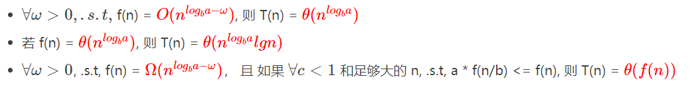

### 分治策略

在分治中，我们递归地求解每一个问题，每层递归都有以下三个步骤

+ 分解
+ 解决
+ 合并

当子问题足够大时，需要递归求解，我们称之为`递归情况`，当子问题变得足够小，不在需要递归时，称为`基本情况`.

三种求解递归式的方法：

+ 代入法：猜想一个界，然后用数学归纳法证明这个界是正确的
+ 递归树法：将递归式转换为一颗树，对不同层次求代价，在相加
+ 主方法

#### 最大子数组问题

一个最大子数组而不是最大子数组，只有当数组中包含负数时，最大子数组才有意义。

使用分治策略求解次问题时，意味着将此数组分为两个规模尽量相等的子数组

```
将A[low, high]分为A[low, mid]和A[mid + 1, high]
最大子数组必定处于以下三种情况之一：
	1.完全位于子数组A[low, mid]中
	2.完全位于子数组A[mid + 1, high]中
	3.跨越了中点
```

+ 函数FIND-MAX-CORSSING-SUBARRAY求解跨越了中点的子数组

```c++
int FindMaxCrossSubarray(int A[], int low, int mid, int high)  //跨越
{
    int left_sum = Infinite;
    int sum = 0;
    for (int i = mid; i >= low; i--)  //左半部的最大子数组
    {
        sum += A[i];
        if (sum >left_sum)
        {
            left_sum = sum;
            //max_left = i;
        }
    }
 
    int right_sum = Infinite;
    sum = 0;
    for (int i = mid + 1; i <= high; i++)  //右半部的最大子数组
    {
        sum += A[i];
        if (sum > right_sum)
        {
            right_sum = sum;
            //max_right = i;
        }
    }
    return left_sum + right_sum;
}
```

+ 分治算法代码

```c++

int FindMaxSubarray(int A[], int low, int high)
{
    int left_sum, right_sum, cross_sum;
    if (high == low)  //一个元素
    {
        return A[low];
    }
    else
    {
        int mid = (low + high) / 2; //分治
        left_sum = FindMaxSubarray(A, low, mid);  //前半部
        right_sum = FindMaxSubarray(A, mid + 1, high);  //后半部
        cross_sum = FindMaxCrossSubarray(A, low, mid, high);  //跨越前后
 
        if (left_sum >= right_sum && left_sum >= cross_sum)  //最大子数组在左边
            return left_sum;
 
        else if (right_sum >= left_sum && right_sum >= cross_sum)  //右边
            return right_sum;
 
        else  //跨越
            return cross_sum;
    }
}
```

+ 分析

```
递归式
T(n) = {
	O(1);
	2T(n/2) + O(n);
}
T(n) = O(nlgn)
```

#### 矩阵乘法的Strasseen算法

暴力法求解矩阵乘法

```c++

void Mul(int** matrixA, int** matrixB, int** matrixC)   
{   
    for(int i = 0; i < 2; ++i)    
    {   
        for(int j = 0; j < 2; ++j)    
        {   
            matrixC[i][j] = 0;   
            for(int k = 0; k < 2; ++k)    
            {   
                matrixC[i][j] += matrixA[i][k] * matrixB[k][j];   
            }   
        }   
    }   
}
```

算法复杂度

O(n^3)

+ 分治思想

```
将矩阵分为4个小矩阵
```

复杂度

```
T(n) = 8T(n/2) + O(n^2) = O(n^3)
```

和暴力法相比，改进不大

+ Strassen方法

减少乘法，用加法替换

伪代码：

```
STRASSEN(A, B)
    n = A.rows
    if n == 1
        return a[1, 1] * b[1, 1]
    let C be a new n × n matrix
    A[1, 1] = A[1..n / 2][1..n / 2]
    A[1, 2] = A[1..n / 2][n / 2 + 1..n]
    A[2, 1] = A[n / 2 + 1..n][1..n / 2]
    A[2, 2] = A[n / 2 + 1..n][n / 2 + 1..n]
    B[1, 1] = B[1..n / 2][1..n / 2]
    B[1, 2] = B[1..n / 2][n / 2 + 1..n]
    B[2, 1] = B[n / 2 + 1..n][1..n / 2]
    B[2, 2] = B[n / 2 + 1..n][n / 2 + 1..n]
    S[1] = B[1, 2] - B[2, 2]
    S[2] = A[1, 1] + A[1, 2]
    S[3] = A[2, 1] + A[2, 2]
    S[4] = B[2, 1] - B[1, 1]
    S[5] = A[1, 1] + A[2, 2]
    S[6] = B[1, 1] + B[2, 2]
    S[7] = A[1, 2] - A[2, 2]
    S[8] = B[2, 1] + B[2, 2]
    S[9] = A[1, 1] - A[2, 1]
    S[10] = B[1, 1] + B[1, 2]
    P[1] = STRASSEN(A[1, 1], S[1])
    P[2] = STRASSEN(S[2], B[2, 2])
    P[3] = STRASSEN(S[3], B[1, 1])
    P[4] = STRASSEN(A[2, 2], S[4])
    P[5] = STRASSEN(S[5], S[6])
    P[6] = STRASSEN(S[7], S[8])
    P[7] = STRASSEN(S[9], S[10])
    C[1..n / 2][1..n / 2] = P[5] + P[4] - P[2] + P[6]
    C[1..n / 2][n / 2 + 1..n] = P[1] + P[2]
    C[n / 2 + 1..n][1..n / 2] = P[3] + P[4]
    C[n / 2 + 1..n][n / 2 + 1..n] = P[5] + P[1] - P[3] - P[7]
    return C
```

#### 代入法

+ 猜测解的形式
+ 用数学归纳法求出解中的常数，并证明解是正确的

#### 递归树

#### 主方法

相当于某种通项公式

```
对于 
	T(n) = aT(n / b) + f(n)
```

