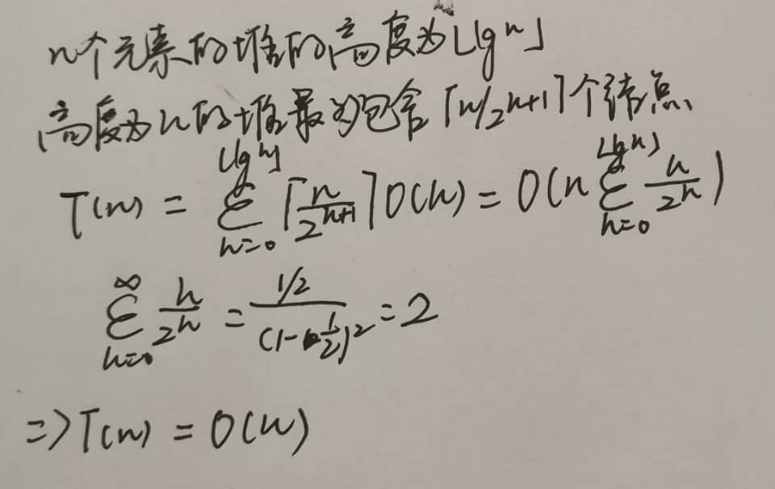

### 堆排序

堆排序时间复杂度为O(nlgn)，同插入排序一样具有`空间原址性`，可以构造一种有效的优先队列


#### 堆

可以被看做一颗近似的完全二叉树

二叉堆分为`最大堆`和`最小堆`

最大堆的性质： 

```
A[parent(i)] >= A[i]
```

最小堆的性质

```
A[parent(i)] <= A[i]
```

```
当用数组表示存储n个元素的堆时， 叶结点下标分别是[n/2] + 1, [n/2]+2,... , n
可根据图判断
```

#### 维护堆的性质

```c++

void maxHeapIFY(int *a,int i){
	int l = (i << 1) + 1;
	int r = (i << 1) + 2;
	int largest;
	if (l <= heapSize && a[i] < a[l])
	{
		largest = l;
	}
	else
	{
		largest = i;
	}
	if (r <= heapSize && a[largest] < a[r])
	{
		largest = r;
	}
	while (largest!=i)
	{
		swap(a[largest], a[i]);
		maxHeapIFY(a, largest);
	}
}
```

+ 分析

假设递归调用会发生

```
因为每个孩子的子树的大小至多为2n/3（最坏情况发生在树的最底层恰好半满的时候）
```

```
T(n)<=T(2n/3) + Θ(1) 根据主定理第二条
T(n)=O(lgn)
```

#### 建堆

```c++

void buildHeap(int *a,int length){
	heapSize = length - 1;
	for (int i = length>>1; i >= 0; i--)
	{
		maxHeapIFY(a, i);
	}

```

+ 分析

每次调用的时间复杂度是O(lgn),需要O(n)次这样的调用，因此总的时间复杂度为nlgn。但是，这个上界虽然是正确的，但是不够紧确。



#### 堆排序算法

```c++
void heapSotr(int *a)
{
	buildHeap(a, 10);
	for (int i = 9; i >= 1;i--)   
	{
		swap(a[i], a[0]);
		heapSize = heapSize - 1;
		maxHeapIFY(a, 0);
	}
}
```

